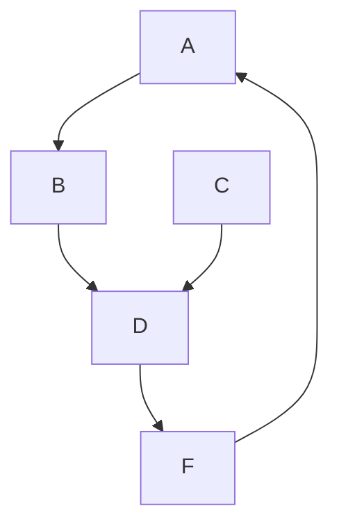
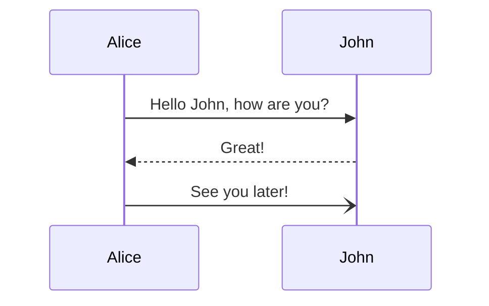

# mdlp

Markdown live preview from the command line! It can use a local command or the [GitHub API](https://docs.github.com/en/free-pro-team@latest/rest/markdown/markdown?apiVersion=2022-11-28#render-a-markdown-document). 

It also renders mermaid diagrams in code blocks.

# Examples For Testing

This section isn't really related to the project itself. I use it when
testing the renderers.

A simple flowchart diagram in [mermaid](http://mermaid.js.org/).



A sequence diagram in [mermaid](http://mermaid.js.org/).



Some Go Code!

```go
package main

import "fmt"

func main() {
	fmt.Println("Hello, world!")
}
```

# TODO

- web socket not staying open.
- emacs package to run it
- github action to build it
- unit testing (? :))
