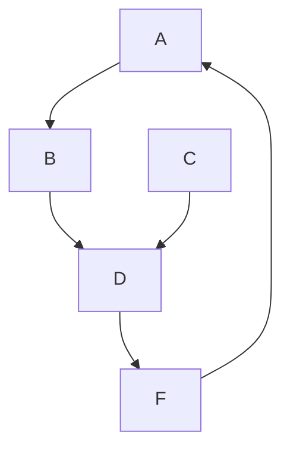
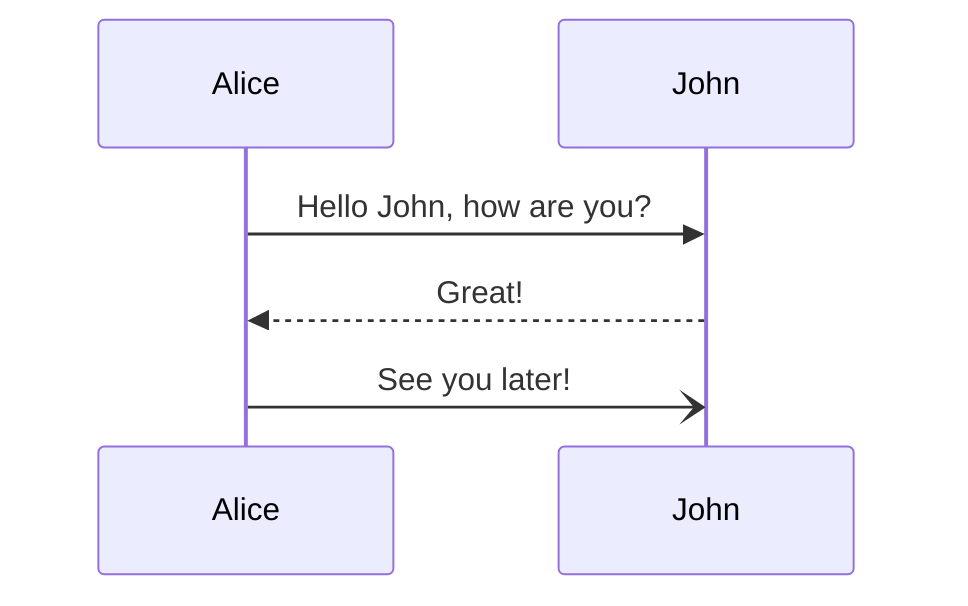

# mdlp

Markdown live preview from the command line! It can use a local command or the [GitHub API](https://docs.github.com/en/free-pro-team@latest/rest/markdown/markdown?apiVersion=2022-11-28#render-a-markdown-document). 

It also renders mermaid diagrams in code blocks.

# Installation

If you have [Go](https://go.dev) installed, you can simply:

```bash
go install github.com/icub3d/mdlp@latest
```

You can also find the latest version on the [releases
page](https://github.com/icub3d/mdlp/releases).

# Integrating with Emacs

Here is how I do it using `use-package` and `straight.el`:

```elisp
;; mdlp
(use-package mdlp-mode
  :ensure t
  :hook (markdown-mode . mdlp-mode)
  :straight (:host github :repo "icub3d/mdlp" :files ("mdlp-mode.el"))
  :config
  (setq mdlp-github-token "your-token-here"))
```

If you keep your token in a file, you can do something like:

```elisp
;; f
(use-package f
  :ensure t
  :straight t)
  
;; mdlp
(use-package mdlp-mode
  :ensure t
  :hook (markdown-mode . mdlp-mode)
  :straight (:host github :repo "icub3d/mdlp" :files ("mdlp-mode.el"))
  :config
  (setq mdlp-github-token (string-trim (f-read-text "~/path/to/my/pat"))))
```

Both of these have the effect of starting up the process when you open
up a file that starts `markdown-mode`. It is still very crude, pull
requests are welcomed.

# Examples For Testing

This section isn't really related to the project itself. I use it when
testing the renderers.

A simple flowchart diagram in [mermaid](http://mermaid.js.org/).



A sequence diagram in [mermaid](http://mermaid.js.org/).



Some Go Code!

```go
package main

import "fmt"

func main() {
	fmt.Println("Hello, world!")
}
```

# TODO

- github action to build it
- unit testing (? :))
- Handle multiple instances in emacs
